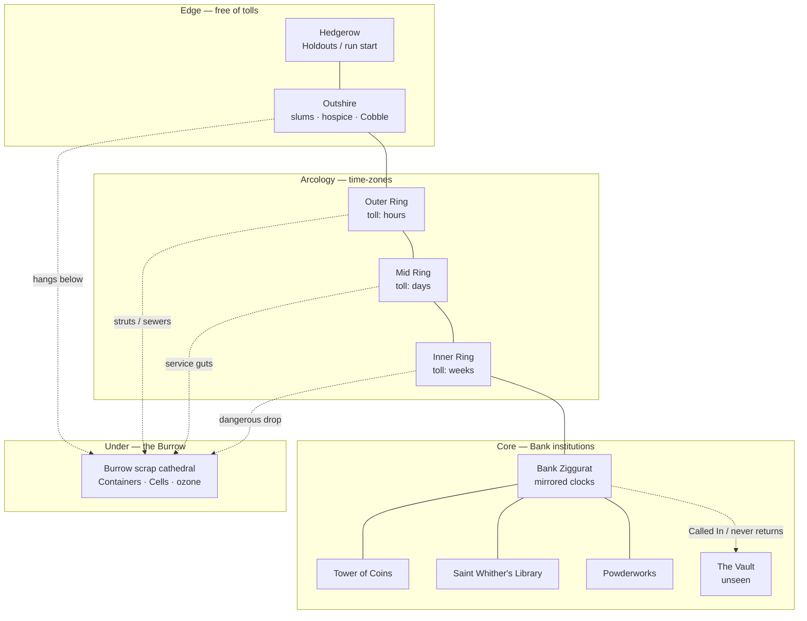
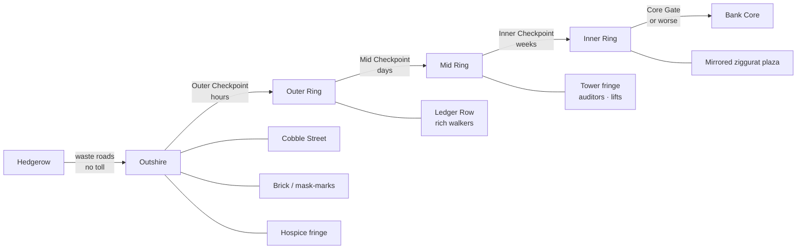
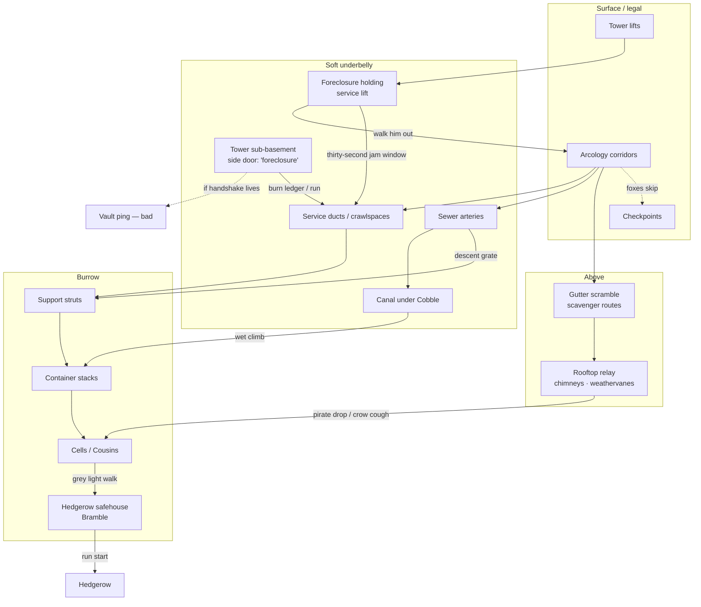
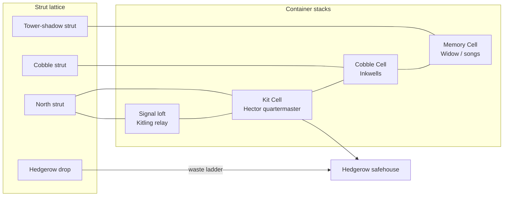
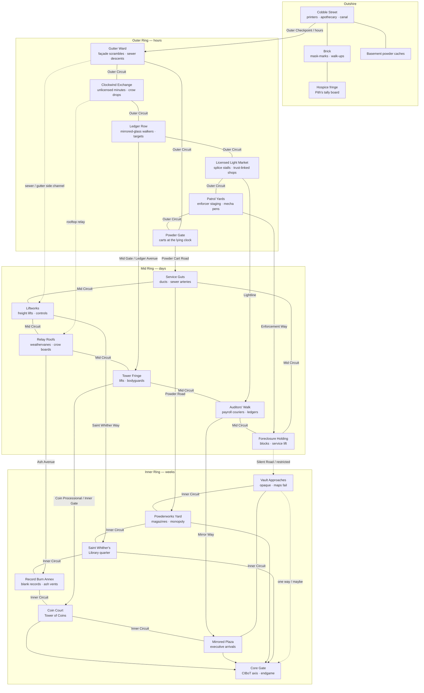
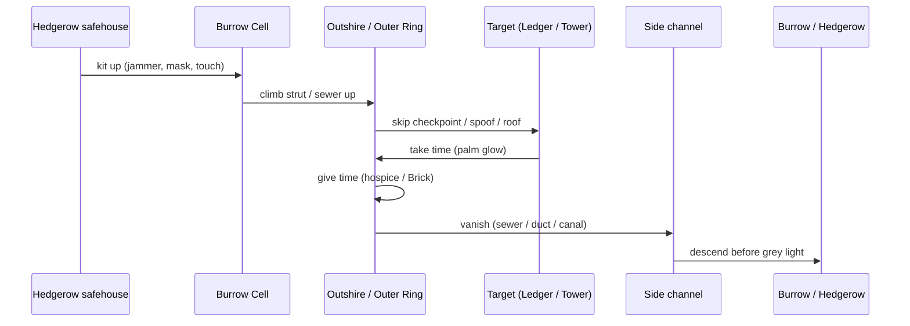

# Fox the Guy — Map Topology

> Not a street atlas. A **connection graph**: where you can go from where, what it costs, and which doors the Bank forgot to watch.
>
> Vertical rule: **up is the heist, down is home.** Most runs begin at the Hedgerow edge, climb into the Outshire / arcology rings, and vanish back into the Burrow before grey light.

---

## 1. The shape of the world

Think rings stacked on struts:

1. **Hedgerow** — outer wastes; Holdouts; run start.
2. **Outshire** — slums, service-towns, no time-toll; redistribution sinks.
3. **Arcology time-zones** — concentric rings, each gated by a checkpoint that charges time (hours → weeks as you move inward).
4. **Core institutions** — Bank ziggurat, Tower of Coins, Library, Powderworks, Vault (opaque).
5. **The Burrow** — hung *under* the arcology: Containers, Cells, scrubbed chrome bolted to support struts.

Foxes mostly skip checkpoints. Foxes use **side channels**.

---

## 2. Radial rings (what checkpoints think is the map)

Official travel is ring-to-ring through **time-toll checkpoints**. Citizens pay. Foxes do not — or they spoof one handshake and pray the serial stays dead.

| Layer | Tone | Typical run verb |
|-------|------|------------------|
| Hedgerow | woods through highways, Holdout camps | brief, kit up, leave |
| Outshire | failing service grid, walk-ups, canal | give time, vanish |
| Outer Ring | licensed light, enforcer patrol density rising | take time, jam optics |
| Mid Ring | Tower-adjacent, ledgers, lifts | infiltrate, burn, steal payroll |
| Inner / Core | mirrored glass, Vault gravity | rarely; Big Plot weather |

---

## 3. Side channels (the real fox map)

These edges are why the Bank has never foreclosed on the concept of Guy. Solid lines are walkable; dashed lines are one-way, timed, or stupid.

### Named side channels

| Channel | Connects | Notes |
|---------|----------|-------|
| **Sewer grate descents** | Outer/Mid Ring → strut lattice → Burrow | Primary vanish. Smell of ozone over shit means you're close. |
| **Service ducts** | Tower fringe, holding blocks, Cobble basements → Burrow | Tight; good for jammer packs and one fox. |
| **Canal under Cobble** | Cobble Street printers ↔ Outshire hospice fringe ↔ Container stacks | Kitling: if the clock ticks, put it in the canal and run. |
| **Rooftop relay** | Chimneys, weathervanes, dead-channel transmitters | Crow coughs = ours; weathervane crow = not. |
| **Gutter scramble** | Outer Ring façades → Outshire walk-ups | Arcology gutter-scavenger trade territory. |
| **Holding service lift** | Foreclosure holding ↔ Mid Ring service floor | Marrow: boredom + static. Jam optics ~30s. |
| **Tower side door** | Tower of Coins sub-basement ↔ service guts | Password *foreclosure*. Rook may be lying. |
| **Powder cart route** | Powderworks gate → Outshire basements → Burrow (if untagged) | Bramble: midnight plus seven; jam if it beeps. |
| **Strut walk** | Container to Container under the vaulted dark | Home. Never licensed. |

---

## 4. The Burrow (Heaven under the machine-city)

Built of straight-world junk hauled down piece by piece. Not a basement — a **hanging city** on the underside of the arcology.

| Node | Function |
|------|----------|
| **Kit Cell** | Harness, jammer packs, riot lances; leakage intake |
| **Cobble Cell** | Pamphlets, scrubbed platen, sickroom |
| **Memory Cell** | Old Songs, mask-marks, ceremonial briefs |
| **Signal loft** | Pirate relays, crow boards, clock drops |
| **Hedgerow safehouse** | Run start / Bramble routes; powder & scrubbed kit |

---

## 5. Districts & landmarks (hooks for missions)

Ring-plan SVGs: [Outer](map_sizes/outer-ring-districts.svg) · [Mid](map_sizes/mid-ring-districts.svg) · [Inner](map_sizes/inner-ring-districts.svg)

---

## 6. A typical night (path grammar)

Most Redistributions rhyme:

**Extraction** swaps the middle for Holding → jam optics → service lift → duct.  
**Powder odd job** swaps the middle for Works gate → cart → jam-if-tagged → Burrow.  
**Pamphlet courier** stays Cobble-heavy: Cell → Cobble platen → canal if burned.

---

## 7. Design notes

- **Checkpoints are for citizens.** Treat them as obstacles and comedy, not as the fox path.
- **Every surface district should have at least one down-edge** into the Burrow (sewer, duct, canal, strut hatch). If a district has none, invent one before shipping a mission there.
- **The Vault is a sink, not a level.** Edges into it are one-way story weather, not a loot room.
- **Cousin territories** sit on nodes, not on whole rings: Bramble (Hedgerow + powder routes), Pith (hospice fringe), Hector (Kit Cell), Inkwells (Cobble Cell), Kitling (signal loft / roofs), Marrow (holding), Tilde (Tower fringe), Rook (Tower side door — maybe), Widow (Memory Cell).

---

*Living document. Add nodes when missions need them; keep edges honest.*
