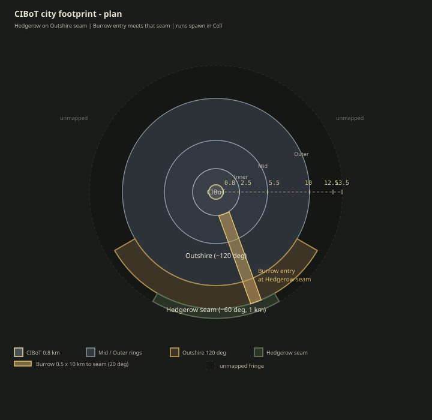
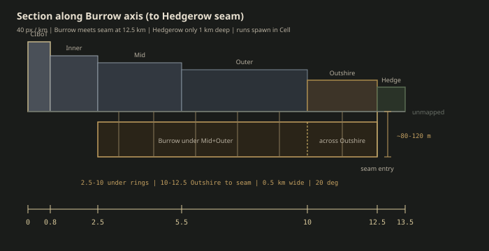
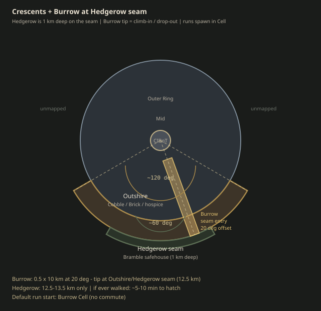

# Map sizes — city footprint

Working scales for building the rings. Topology and side channels stay in [map.md](map.md); this file is **how big** each layer is from the CIBoT center out.

Plan distances are **radii** from the Bank ziggurat axis. The **Burrow** is not another surface ring — it hangs **under** the arcology on the support-strut lattice (see vertical sizes below).

## Canonical radii (surface)

| Layer | Outer radius | Ring width | Toll (citizens) | Role |
|-------|--------------|------------|-----------------|------|
| **CIBoT Core** | **0.8 km** | — (disk) | Core Gate / worse | Bank ziggurat, Tower of Coins, Library, Powderworks yard, Vault approaches |
| **Inner Ring** | **2.5 km** | 1.7 km | weeks | Mirrored plaza fringe; rare fox nights |
| **Mid Ring** | **5.5 km** | 3.0 km | days | Tower fringe, ledgers, holding blocks, lifts |
| **Outer Ring** | **10 km** | 4.5 km | hours | Licensed light, patrol density rising; primary take-time belt |
| **Outshire** | **~12.5 km** | **~2.5 km** deep | none | Slums / Cobble / hospice — **~120° crescent** on the Outer Ring |
| **Hedgerow** | **~13.5 km** | **~1 km** deep | none | Holdouts / Bramble safehouse — **~60° crescent** on the Outshire seam (not a deep wastes belt) |

The rest of the land outside the Outer Ring is **unmapped fringe** — not Hedgerow content. Only the two crescents need districts, safehouses, and art.

**Roguelike pacing:** runs **spawn in a Burrow Cell** (kit + Cousin brief). Hedgerow is origin flavor and safehouse fiction; the player does not walk Hedgerow→Outshire every run. If that path is ever played, it is a seam hop of minutes, not a commute.

## The Burrow (under)

Hung city: Containers, Cells, and scrubbed chrome bolted to struts under the machine-city floor. **Up is the heist; down is home.**

Not a ring. A **thin rectangular strip** under the arcology, angled off the Outshire approach so it is not a full under-city.

| Property | Working value |
|----------|----------------|
| **Plan shape** | **Rectangle** (corridor), not an annulus |
| **Width** | **~0.5 km** |
| **Length** | **~10 km** — under Mid+Outer (**2.5 → 10 km**), then across Outshire to the **Hedgerow seam** (**10 → 12.5 km**) as the entry |
| **Bearing** | **20° offset** from the Outshire crescent centerline (bearing ~70° from east / SE) |
| **Hang depth** | **~80–120 m** below arcology underside |
| **Plan area** | **~5 km²** |
| **Toll** | none (never licensed) |

The outer tip of the strip meets the **Outshire / Hedgerow seam**: Bramble's door, canal hatch, and Burrow entry are the same neighborhood. Cells and Container stacks sit along the Mid–Outer span ([map.md](map.md) §4). The rest of the strut lattice stays dark crawl / unmapped.

### Crescents (Outshire + Hedgerow)

Neither fringe encircles the Outer Ring. Both are **sectors**; Hedgerow is the smaller, thinner one, pressed to Outshire's outer edge (same general SW–SE approach).

| Property | Outshire | Hedgerow |
|----------|----------|----------|
| Angular span | **~120°** | **~60°** (nested in Outshire's south arc) |
| Radial band | **10 → 12.5 km** | **12.5 → 13.5 km** |
| Depth | **~2.5 km** | **~1 km** (seam only) |
| Chord (inner edge) | **~17 km** along Outer façade | **~13 km** along Outshire outer edge |
| Typical contents | Cobble, Brick, hospice, basements | Holdout camps, Bramble safehouse |

### Areas (approx.)

| Layer | Plan area |
|-------|-----------|
| CIBoT Core | ~2.0 km² |
| Inner Ring (annulus) | ~18 km² |
| Mid Ring (annulus) | ~75 km² |
| Outer Ring (annulus) | ~240 km² |
| Outshire crescent (~120°) | ~59 km² |
| Hedgerow crescent (~60°, 1 km deep) | ~14 km² |
| Burrow strip (0.5 × 10 km, to Hedgerow seam) | ~5 km² |

Arcology built footprint (core through Outer Ring) ≈ **π × 10² ≈ 314 km²** — one dense machine-city disk, not a continent.

## Night-run scale check

A fox scrambling gutters / sewers / struts at rough **6–8 km/h** effective pace:

| Trip | Distance | Time (order of) |
|------|----------|-----------------|
| **Run start (default)** | — | **Spawn in Burrow Cell** — no commute |
| Hedgerow seam → Burrow entry (if played) | ~0–0.5 km + hatch | **~5–10 min** |
| Outer façade → Mid target | ~2–4 km radial | 20–40 min |
| Mid target → Outshire hospice | ~3–5 km | 30–50 min |
| Outer → Core | ~9 km radial | half a night — **rarely** |
| Surface grate → Burrow Cell (vertical) | ~80–120 m hang + strut scramble | 5–15 min if you know the hatch |
| Burrow strut walk, Cell to Cell | along the 0.5 km strip | 10–25 min |

The long scramble is **during** the mission (up into the rings), not before it. Inner/Core remains Big Plot weather.

## Diagrams

SVG sources live in [`map_sizes/`](map_sizes/).

### Plan — rings, crescents, Burrow strip

### Radial section — along the Burrow axis

### Crescent detail — Outshire, Hedgerow, angled Burrow

## Design notes

- Radii are **authoritative until a mission needs a lie** — if a district needs more room, widen that ring and update this table.
- Checkpoints sit on the **boundaries** (Outer / Mid / Inner edges), not mid-annulus.
- The Burrow is a **0.5 km-wide rectangle** at a **20° offset**, under Mid+Outer and out to the **Outshire/Hedgerow seam** as the entry.
- **Do not generate** a full wastes ring. Hedgerow is a thin seam crescent only; other Outer perimeter stays unmapped.
- Outshire incomplete on purpose: Cobble is a place you can learn, not a belt that surrounds the Bank.
- Every surface district that ships a mission needs at least one **down-edge** into the Burrow (sewer, duct, canal, strut hatch).
- Roguelike loop: **Cell brief → climb → target → extract back to Burrow** (or die). Hedgerow is flavor / rare Holdout path, not the cold open.

---

*Living document. Adjust numbers when ring art or mission pacing fights the scale.*
