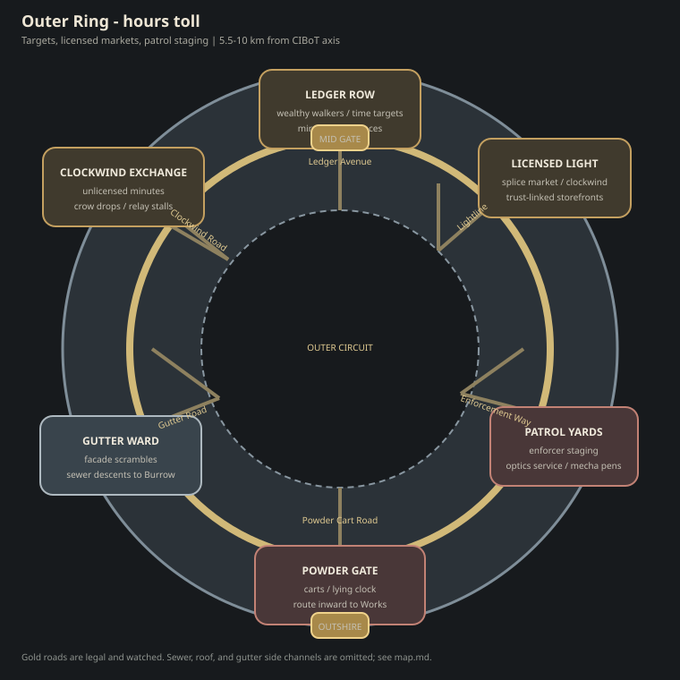
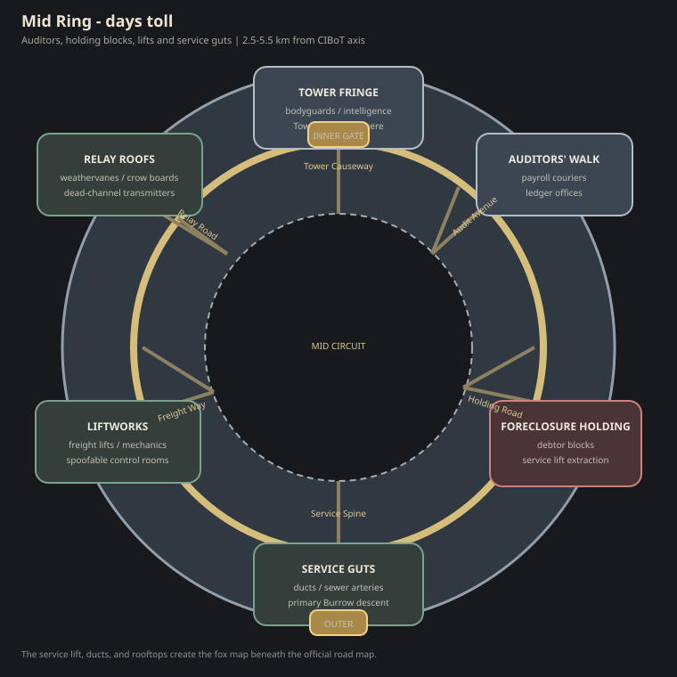
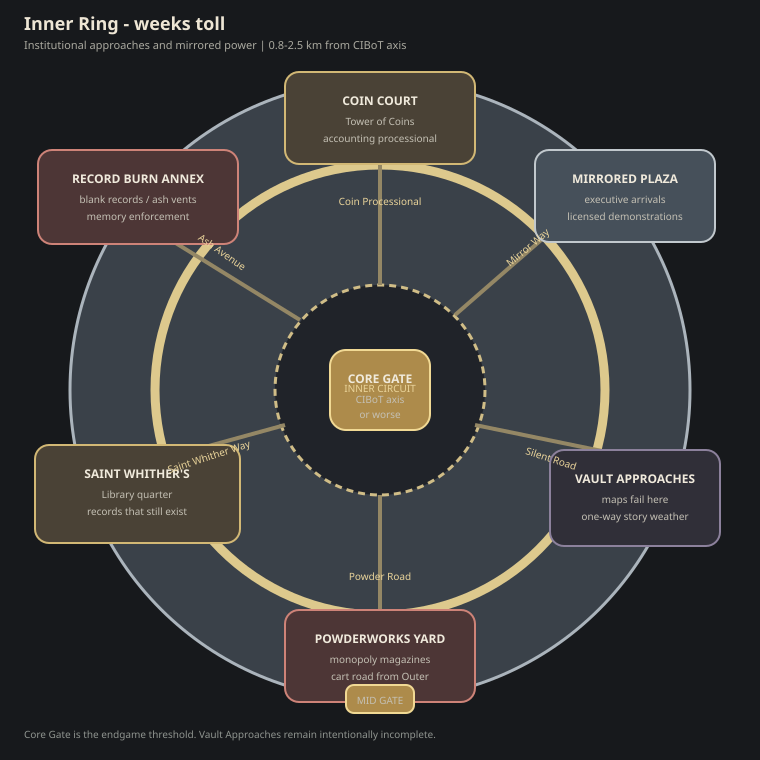

# Fox the Guy — Story Bible

> *"Remember, remember, the kindling of November —*
> *the powder, the burrow, the plot.*
> *I see no reason the Foxes' treason*
> *should ever be forgot."*
>
> — fragment, sung by children in the Outshire arcology slums.
> The verse is older than the Bank. No one alive remembers what it originally meant.

This document is the **worldbuilding sourcebook** for *Fox the Guy*. It is not a plot. It is the **shape of a world** in which many small, doomed, often funny stories can happen. Each run is one such story.

We are working from five creative touchstones:

1. **Robin VanGilder's [*Towards a Better Roguelike: How to Tell a Story*](https://beigemoth.blog/2019/04/11/towards-a-better-roguelike-the-problem-of-plot/)** — build the world, not the plot. The protagonist is generic by design. The big story happens off-stage.
2. **Deltron 3030** (Del the Funky Homosapien, Dan the Automator, Kid Koala, 2000) — the album that gave us the **Corporate Institutional Bank of Time**, the figure of the lone rhyme-fighter against a galaxy-spanning corporate dystopia, and the tone: irreverent, funky, defiant, weird, mythic. Not grimdark. Not chosen-one heroic. A swagger against an absurd machine.
3. **Rocket Raccoon (MCU *Guardians of the Galaxy*) and Fox McCloud (*Star Fox 64*)** — the visual lineage for the protagonist. A small, sharp-eyed, anthropomorphic fox bristling with tactical gear too big for him. Rocket provides the silhouette detail (scavenged, mismatched, snarky, *underestimate-me-at-your-peril*); Starfox provides the silhouette shape (pilot/operator harness, mission patches, callsigns, a sense of being part of a squad of equals).
4. **In Time** (Andrew Niccol, 2011) — the film that puts time-as-currency on people's arms as a glowing countdown, and frames the protagonist as a Robin Hood who steals time from the rich and gives it to the dying poor. We are taking from it (a) the visible mortality clock every citizen wears, (b) the stratified time-zones of the world separated by time-toll checkpoints, and (c) the **Robin Hood structure of the player's night-to-night gameplay**: rob the wealthy, redistribute to the Outshire, do it again before dawn. The Big Plot stays Guy Fawkes; the small plot is Robin Hood.
5. **The Matrix** (Wachowskis, 1999) — not for the simulation, but for **vertical geography**: Zion in the caverns beneath the Machine City; the last free humans raid upward into a world that thinks it owns the sky. The **Burrow** under the **arcologies** is the same shape — down is home, up is the heist, back down before the machines notice.
6. ***Johnny Mnemonic*** (1995) — specifically **Heaven**, the Lo-Tek headquarters: a scrap cathedral built entirely out of straight-world junk, hauled piece by piece into the underside of a dead bridge. The name sounds low-tech; the people are not. They run stolen corporate hardware, pirate broadcasts, and a resistance that lives *in* the city's discarded infrastructure. The **Burrow** is that energy under the arcologies — scavenged Bank chrome welded into tunnels, Containers and Cells hung from the underside of the machine-city, advanced kit with the logos scratched out.

Two principles in particular from the article:

- **Build the world, not the plot.** Lore is a sandbox, not a script. Leave gaps. The player fills them in.
- **The protagonist is generic by design.** The player is a Guy, not *the* Guy. There have been many. There will be more.

---

## 1. The Setting: The Bank and the Burrow

The year is somewhere around 3030. Or it might be. Time is hard to come by anymore.

There is one Corporation. It used to have competitors. It does not anymore. Its formal name is long and full of trademarks; its informal name, the one used in courtrooms and graffiti alike, is **the Corporate Institutional Bank of Time** — the Bank, for short, or **CIBoT** (pronounced "see-bot") when you want to sound like you know your way around a foreclosure notice.

The Bank does not lend money. Money is a thing of the past — or rather, a thing of the Bank's marketing department. The Bank lends **time**: hours, weeks, years of human life, drawn from a vast **Vault** no one is allowed to see. You take out a loan of time when you need to live longer than you can afford. You pay it back in labor, in service, in years deducted from the end of your life. Most citizens are born already in debt: their parents borrowed to feed them.

When a debtor cannot pay, their **ledger band** enters the warning state first: the display blinks red, and the cuff emits a sharp, repeating tone — loud enough to carry down a block, impossible to sleep through. The Bank's network hears it too. **Enforcers are dispatched.** So is every fox in earshot who knows what the sound means.

If no one intervenes, the balance hits zero and the debtor is **Called In**. They do not drop dead on the pavement — not yet. They are conscious, marked, often on their knees, band still screaming red while the enforcers close in. The debtor is taken to the Vault. They are not seen again. Whatever hours were left on the band are repackaged and sold to clients who can afford to live forever, or close enough.

**Guy's most common save** happens in that window: kill the enforcer, touch the debtor, run. The Bank's pamphlets insist that running out of time means instant death. The Burrow knows better.

The Bank presents this as a market. The Burrow calls it what it is.

Beneath the arcologies — literally — hangs the **Burrow**. The arcologies are the Bank's machine-city: mirrored towers, checkpoints, licensed light, enforcers in the upper levels. The Burrow is what was built into the underside — shipping containers and stolen floorplates bolted to support struts, server racks gutted and rewired, Cells stacked like a scrap cathedral under the vaulted dark. It smells of ozone, wet fur, solder, and black powder. Foxes **go up** to steal time and make trouble; they **go down** to survive the night. The vertical map is the game's map: the Hedgerow and the Outshire at the edges, the arcology rising in rings of wealth, the Burrow always below, always there when you need to vanish.

The Burrow is the secret nation of the small and the foreclosed: foxes, hares, weasels who turned coat, crows who carry letters they cannot read, debtors who slipped the leash, hackers who burned their own ledgers. Everything in it was hauled down piece by piece from the straight world — Bank junk, Outshire salvage, Hedgerow scrap — and welded into something the Bank never licensed. The Burrow has no CEO. It has Cells. It has Cousins. It has, most importantly, a name on every tongue. The Bank knows the Burrow exists. The Bank has never successfully foreclosed on it.

That name is **Guy**.

### Pillars of the Bank

These institutions are the playing field. They give us districts, factions, and targets.

- **The Vault.** The literal storage of time. Nobody knows what it actually looks like. Pamphlets disagree wildly: a cathedral of clockwork, a server farm the size of a moon, a single grandfather clock, an empty room. Some say time was never a real thing, and the Bank is a confidence trick that hardened into infrastructure.
- **The Tower of Coins.** The Bank's accounting wing. Forgery of time-script is treason **and** sorcery, which carries a separate, more elaborate punishment.
- **The Library at Saint Whither's.** Originally a monastery, then a university, now the Bank's information division. They decide which records exist. The ones that don't get filed get burned out of the people who remember them.
- **The Powderworks.** The Bank's munitions subsidiary. Saltpetre, charcoal, sulfur — yes, in 3030, because explosives that don't connect to a network can't be remotely disabled. Officially a monopoly. Unofficially, every basement in the Outshire has at least a thimbleful.
- **The Bank itself** — the building. A colossal mirrored ziggurat in the heart of the arcology, with clocks on every face. The roof is rebuilt, after a previous incident, in panes of leaded crystal — partly for light, partly so the populace can see, from a great distance, that their betters are still there.
- **The Founder.** Old. Possibly dying. Possibly already dead and being run as a brand. Possibly never existed. The pamphlets cannot agree.

### The Outshire and the Hedgerow

Outside the arcologies are the **Outshire** — the slums, the service-towns, the failing infrastructure where the Bank's foreclosed end up. Beyond the Outshire is the **Hedgerow**: irradiated wastes, dead suburbs, deep woods that have grown back through old highways. Out here live the **Holdouts**: those who never took a loan from the Bank, who remember when the world was older and stranger. The Burrow recruits from the Hedgerow when it can. The Hedgerow mostly laughs at the Burrow for thinking the Bank can be brought down.

Most foxes come to the Burrow through the Hedgerow. A playable run begins in a Burrow Cell after that journey: mask, kit, Cousin brief, then up into the rings.

### Districts of the Arcology

Each time-zone has a watched ring road and radial roads leading to its checkpoint. Fox routes use the same districts but prefer roofs, gutters, lifts, ducts, and sewers.

#### Outer Ring — hours

Ledger Row supplies wealthy targets. Licensed Light and Clockwind Exchange move legal and less-legal technology; Patrol Yards stage enforcers; Powder Gate feeds carts inward; Gutter Ward provides the cleanest descents toward the Burrow.

#### Mid Ring — days

Tower Fringe and Auditors' Walk hold payroll and intelligence. Foreclosure Holding supplies extraction missions. Liftworks, Relay Roofs, and Service Guts form the Mid Ring's soft underbelly.

#### Inner Ring — weeks

Coin Court, Saint Whither's, the Powderworks Yard, and Mirrored Plaza surround the Core Gate. The Record Burn Annex destroys inconvenient memory. Vault Approaches appear on official plans, but the plans stop agreeing there.

### How Time Works in Practice

Every Bank-licensed citizen wears a **ledger band** at the wrist — a thin glass-and-metal cuff that displays their remaining balance in glowing characters. The band is tied to the Vault by something the Bank's engineers call a *trust link* and the Burrow's mechanics call *obvious bullshit, here's how to spoof it.*

When the balance falls into the danger range, the band **blinks red and beeps** — the same signal that summons enforcers and, if anyone in the Burrow is listening, Guy. That is the rescue window. If it closes without intervention, the display locks at zero, the debtor is **Called In**, and the enforcers finish the job. Death in the street is a myth the Bank likes; the Vault is where people actually disappear.

Bands transfer hand-to-hand by a brief skin contact: a handshake, a touch, a grip on the throat. The gesture is the same whether the transfer is commerce, charity, or robbery — which is approximately how the Bank prefers it to remain.

**Foxes do not wear ledger bands.** They are not citizens. They cannot transact with the Vault directly, cannot pay tolls, cannot be foreclosed on as individuals (the Bank may, however, still try to foreclose on the *concept* of them). A fox can, however, take time off a citizen with a touch, and put it onto another citizen the same way. **This is the basic verb of the game.**

The arcology is divided into **time-zones**: concentric rings, each gated by a checkpoint that charges time to cross. The wealthy zones at the core charge weeks. The outer zones charge hours. The Outshire charges nothing, because the Outshire is not a place anyone goes on purpose. Foxes mostly don't pay checkpoints. Foxes mostly don't take checkpoints.

### A note on aesthetic

The world is 3030, or near enough. The Bank gleams chrome and glass and mirrored servers and walking mecha. The Burrow gleams too — but wrong. **This is on purpose.**

Every new technology gets surveilled, co-opted, or owned by the Bank within months of its invention. The Burrow's answer is not nostalgia. It is **theft**. The foxes strip Bank kit of its trust-links, scratch out the serials, rewire the faces, and hang the leftovers under the arcology until the scrap becomes a city. What cannot be stolen clean gets paired with things the network cannot touch: hand-printed pamphlets, gunpowder, songs sung to children, a knife in the dark, a name no one writes down.

So the Bank shines licensed light. The foxes shine stolen light — HUD amber in a mask that used to belong to an enforcer's faceplate, pirate signal bleeding through a dead channel, a Container bolted to a strut that was never meant to hold a home.

---

## 2. The Foxes

A Fox, in this world, is both a **species** and a **vocation** — and the second meaning came first.

Foxes are real. They are anthropomorphic: bipedal, sharp-snouted, brush-tailed, knee-high to a human, intelligent in a way the Bank's lawyers have spent three centuries trying very hard not to formally acknowledge. They are visibly *fox* — russet fur, white throat, dark stockings, ears that swivel — never mistaken for anything else in silhouette.

**Where they came from is one of the things the Burrow argues about most.** The most popular story is that long ago, before the Bank consolidated, a corporate biolab uplifted them for some forgotten reason and they walked off the lot. Other stories say foxes were always like this and the Bank only noticed when foxes started stealing from them. The Bank's official position is that foxes are unlicensed biological assets. The foxes consider this hilarious.

Whatever their origin, they are not citizens. They cannot take out a loan from the Bank, which means — depending on who you ask — either *they are free of the Bank's debt* or *they were never offered the dignity of being enslaved by it*. Both views are common in the Burrow, sometimes from the same fox in the same conversation.

You become a Fox-with-a-capital-F — that is, **Guy** — when you put on the mask. The mask is not folk craft. It is **stolen CIBoT tech**: a Bank faceplate, vault-visor, or trust-link interface, stripped of its serial, rewired in the Burrow, and cut down to fit a fox's snout. The grin is etched or projected; the amber eyes are sensors. Anyone wearing it is, for that night, called Guy. When the mask comes off — or when its wearer dies, which is more common — Guy has gone away again. He will be back.

This is the *only* fixed point in the story. Everything else can be filled in.

### What a Fox Looks Like

The silhouette is the contract with the player. Get this right and the rest follows.

- **The fox underneath.** Small. Lean. Wiry. Reads as competent before they've done anything. Eyes do most of the acting.
- **The mask.** Stolen Bank faceplate or vault-visor, fox-snout cut, corporate logos dead. Sharp grin, amber sensor-eyes, HUD bleed at the edges. Usually pushed up onto the forehead when not actively committing treason. It looks like the Bank's own tech wearing a traitor smile.
- **The harness.** A scavenged operator's plate carrier or webbing rig, cut down and re-stitched to fit a fox-sized frame. Pouches for spoofed chips, primers, ink for the pamphlets, a wax-paper packet of black powder, a folded copy of tonight's mission.
- **The patches.** Hand-stitched or hand-painted over corporate webbing. Squad insignia from groups that mostly no longer exist. A mask-mark. Sometimes the names of dead cousins, in small careful letters.
- **The piece.** Stolen Bank kit, scrubbed and overclocked. Range runs from a pocket jammer that blindfolds enforcer optics for thirty seconds, to a cut-down riot lance that throws experimental energy the Vault never cleared for street use. Serials burned. Trust-links cut. *Never* something that still answers when the Vault pings.
- **The personal touches.** Charms. A prayer bead from a religion the Bank discontinued. A child's drawing, folded small. Tape with handwriting on it. One thing that the player can imagine is precious to *this particular* fox, even though they will be dead by morning.

The overall read: **Rocket Raccoon's energy, in Fox McCloud's silhouette, under a Guy Fawkes grin built from stolen CIBoT chrome, in a world that thinks of him as inventory.**

The Burrow does not mass-produce this kit. Every loadout is individual, mismatched, hand-finished from whatever was stolen last week. That is the look. If two foxes show up dressed identically, one of them is probably an undercover Bank operative and *both* of them are about to have a very bad night.

### Why this matters for the game

Every run, the player is a different fox who has, just this morning, picked up the mask. They have:

- A **name** that is *not* Guy. (Generated. Sometimes silly. Sometimes sad. Brother Inkwell. Old Marrow. The Widow Plumb. Tiny Thomas Quickfoot. Foreclosure №889-D.)
- A **trade** they had before they took up the mask. (Apothecary. Tanner. Mask-rewirer. Jammer-pack scrubber. Pirate-relay tech. Disgraced clerk. Pickpocket. Time-broker, defected. Mecha-mechanic, fired.)
- A **reason**, usually small. Not "to save the world." Something like: *the Bank foreclosed on my mother;* or *I needed the hours;* or *I was already going to die of the cough, and what's the Bank going to do, call in my time twice?*
- A **wearing of the mask** that is, by tradition, only for *this one night.*

They will, of course, die. Usually badly. Their trade-tools, their reason, their small surviving belongings will be passed quietly to a cousin, who may one night put the mask on themselves.

The legend of Guy grows from these deaths. Not from any single one of them.

### The First Guy

There was, the songs say, a first Guy. He may have been a real fox. He may have been a story the Burrow told to give itself courage.

He lived *long before the Bank* — long enough ago that the original target was something else, some other tower, some other tyranny no one remembers anymore. He tried to blow it up and failed, and was hanged for it, and when the soldiers cut his body down they found the mask was empty — or powered down, depending which song you trust.

The mask passed down. The targets changed. The hardware changed with them: pulp, then metal, then Bank chrome with the trust-link cut. The grin is still here.

We **do not confirm or deny** any of this in the game. Different NPCs believe different things. Some of them are lying. Some of them are right.

---

## 3. The Plot (the small one, and the big one)

Per the article's advice: there is a Big Plot, and **the player does not get to fully participate in it.** They glimpse it. They contribute to it sideways. They die before they see how it ends.

### The Big Plot (off-stage, slow, mostly opaque)

The Burrow has, for as long as the Burrow has existed, been planning to blow up the **Corporate Institutional Bank of Time**. Specifically: to breach the Vault, and release the stolen time back to the people it was taken from.

Whether this means a literal explosion that physically frees physical time, or a symbolic destruction of the institution, or some third thing — the Burrow's philosophers disagree, sometimes violently. The Plot is the same Plot in any case. Every Guy is, at some level, working toward it.

Something else is also wrong at the heart of the Bank. The pamphlets say different things on different days:

- The Founder is being replaced piece by piece — with a wax effigy, or an AI, or a series of body-doubles.
- The Library at Saint Whither's has begun burning *blank* records, and no one knows why.
- A comet was seen, or wasn't. The Bank says it wasn't. The Bank says a lot of things.
- The Powderworks have been quietly doubling output for six years.
- A child was born in the Outshire whose foreclosure papers were already filed *before* her birth — pre-dated by a hundred years.
- The Vault has begun making sounds.

Some of these are true. Some are propaganda — from the Bank, or from the Burrow, or from someone else. The player can read them in scraps, hear them in tavern gossip, find them contradicting each other in the same run. The game **never resolves the Big Plot directly**. It just slowly changes the weather of the world from run to run.

### The Small Plot (one run, one Guy)

A run is a single night's work. Most nights, the work is the same shape:

> **Take time from the rich. Put it in the hands of someone who is running out. Get back to the Hedgerow before the Bank's enforcers find the body.**

The Burrow calls this a **Redistribution**, in their pamphlets, with what the foxes consider unnecessary ceremony. Out in the field, it's *a run, a stretch, a Tuesday.*

The wealthy target might be a Bank middle-manager walking home from a long lunch with three months on his band; a Tower-of-Coins auditor with half a year on hers; a courier carrying a syndicate's payroll. You touch him. The band ticks down. You walk away with the time in your hand — meaning, on your *palm*, glowing through the fur, until you off-load it. The recipient might be a foreclosed family in the Outshire counting minutes, a Cousin running out the door of a hospice, a stranger in an alley whose band is blinking red. You touch them. Their band ticks up. You leave by the rooftops.

The math rarely balances. You always take more than you give — some sticks to the fox, by accident or by design, and the difference is what funds the Burrow. The Cousins call this **the leakage**. They are unsentimental about it. Robin Hood needs to eat.

**Not every mission is a Redistribution.** The Cousins also hand out odd jobs around the edges:

- *Get this letter to the printer's on Cobble Street before dawn.*
- *The powder cart leaves the Works at midnight. We want one barrel of it.*
- *There is a debtor in foreclosure-holding who knows a name. Get them out, or get the name.*
- *Burn the ledger. Do not be seen.*
- *Bring this clock back to the Burrow. Do not wind it. Do not let it tick.*

These are small. They are the kind of thing a single fox might actually do. Most go wrong. Some succeed and turn out to have been bait. A few — quietly, in the background — turn out to have mattered enormously, because they were never about what they looked like; they were about chipping a single brick out of the wall of the Bank.

The player will rarely be told which was which.

---

## 4. Voices in the World

Per the article, the world should speak to the player in its own voice — through documents, songs, propaganda, gossip. Some forms we'll lean on:

- **Wanted posters.** Pinned in every arcology corridor and Outshire wall. Always for Guy. The drawing is always the same mask. The reward, denominated in *years of time*, keeps going up.
- **Broadsheets and pamphlets.** Cheap, ink-smudged, full of lies. The Bank prints them. The Burrow prints them. So do at least two other parties no one can identify.
- **Pirate broadcasts.** Static-laced, three-minute, broken into the Bank's licensed channels by a transmitter the operators move every night.
- **Confessions.** Found on the bodies of failed Guys. Sometimes real. Sometimes planted. Sometimes Guy wrote his own ahead of time, just in case.
- **The Old Songs.** Children sing them without understanding. They rhyme. They are how the Burrow passes news that cannot be written down — and that the Bank's analysts can't seem to parse.
- **Mask-marks.** A small fox's mask, scratched into stone or sprayed onto chrome, means *one of us died here. Walk softly.*
- **Marginalia in burned records.** The Library has been burning books for so long that some of its remaining books have margins full of notes from books that no longer exist.

These are the carriers of lore. Each is a chance to plant ambiguity, contradiction, and texture.

---

## 5. Themes

Held loosely, not as a moral, but as a tuning fork:

- **The mask is heavier than the fox.** Symbols outlive the people who carry them, and they don't always behave the way their carriers hoped — especially when the symbol is still half Bank hardware.
- **Time as currency, time as theft.** What the Bank calls a loan, the Burrow calls a hostage situation. Most of your life is already spoken for. The Plot is, in part, about taking it back.
- **Robin Hood is the small story; Guy Fawkes is the big one.** The night-to-night verb is to steal time from the rich and give it to the dying. The once-in-a-generation dream is to blow up the Vault and free all of it forever. Both are the same impulse on different scales — and most foxes only ever live the small one.
- **Their tools, our city.** Anything licensed gets surveilled. The Burrow's strength is that it lives in stolen Bank tech — scrubbed, rewired, hung under the arcology where the Vault's maps go soft.
- **Small acts, distant consequences.** A bell rung on the right night will, eventually, bring down a tower. A bell rung on the wrong night just wakes the watch.
- **The state and the story it tells about itself.** The Bank's lies and the Burrow's lies are not symmetrical, but they are made of the same paper — and sometimes the same circuit boards.
- **Cyclical time, not heroic time.** No Guy ends the story. The story is the cycle. The fifth of November comes every year. It came before the Bank. It will come after.
- **Comedy at the edges of dread.** Pratchett crossed with Deltron 3030: a swagger against an absurd machine. A failed plot is still a story, and often a funnier one than a successful plot.

---

## 6. Open Questions (to be answered in play, in art, or never)

Deliberate gaps. We do not pin these down yet.

- What is actually in the Vault?
- Is the Founder a person, an AI, a brand, or a corpse on a throne?
- Is time *real* — a substance the Bank actually holds — or a fiction so robust it became real?
- Where did the foxes come from? *Pamphlets and pirate broadcasts give wildly different answers. We will leave the truth a moving target.*
- How many Guys have there been? *Unknown. Some songs say seven. Some say seven hundred. One pamphlet insists there has only ever been one, who keeps coming back.*
- What was the original target — the one the First Guy tried to blow up, before the Bank existed?
- Does the Plot ever, in any timeline, succeed? *We will not answer this in dialog. We may answer it, obliquely, in the state of the world after enough runs.*
- Who writes the wanted posters? *We have an idea. We will not tell.*

---

## 7. What this document is *not*

- It is not a script. There are no scenes here, and no dialog lines yet.
- It is not a list of levels, bosses, or quests. Those will be designed against this world, not the other way around.
- It is not fixed. Anything in this document can be changed, *except* the one rule:

> **Guy is the mask. Anyone who wears the mask is Guy. No one is Guy when the mask is off.**

Everything else is negotiable.

---

*Next steps for the writer's room:*

- *Draft 6–10 sample Cousins (questgivers) with distinct voices.*
- *Draft 20 starting "trade + reason" pairs for procedural fox generation.*
- *Write the first three pamphlets — one Bank, one Burrow, one unattributable — to set the prose voice.*
- *Sketch the Vault, knowing it will never be seen clearly.*
- *Decide the in-world name of the fifth of November — the one date the Burrow universally observes.*
